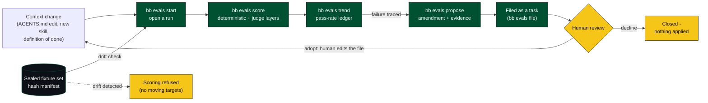
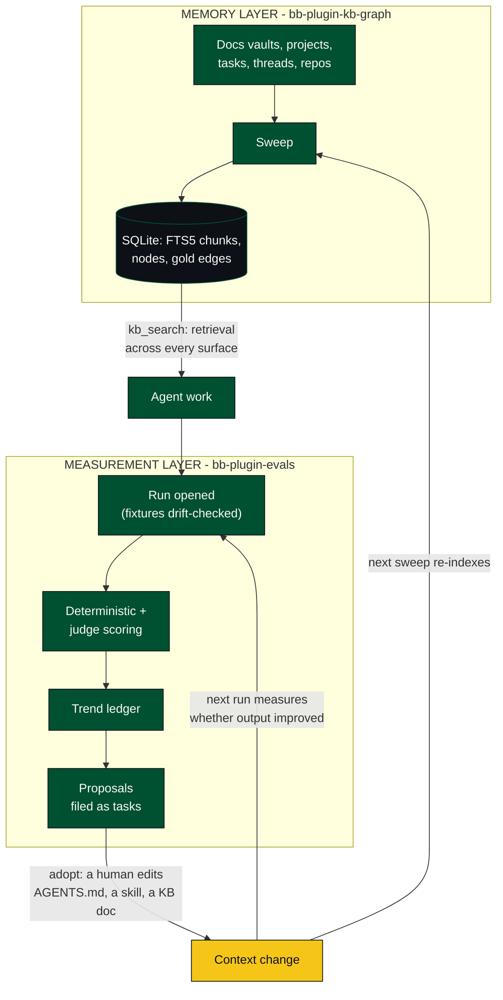

# bb-plugin-evals

A [bb](https://github.com/ymichael/bb) plugin implementing the eval ratchet: a
sealed-fixture ledger that measures whether context changes (an AGENTS.md
edit, a new skill, a tweaked definition of done) actually improve agent
output, and files the resulting proposals as tasks instead of applying them.

## How it works




## How they work together

kb-graph is the memory layer; evals is the measurement layer. The agent retrieves context through `kb_search`; evals scores runs against sealed fixtures and files improvement proposals as tasks; a human adopts by editing AGENTS.md, a skill, or a KB doc; the next sweep re-indexes the change and the next run measures whether output improved.




## Two invariants

- **No apply operation exists.** The plugin can propose an amendment and read
  state; there is no code path anywhere in `server.ts` that writes to a target
  document. Adoption is always a human editing a file.
- **Drift refuses to score.** Fixture sets are sealed by a hash manifest of
  their contents. If a sealed fixture set has drifted since it was sealed,
  scoring refuses outright rather than silently optimizing against a moving
  target.

## Install

```
bb plugin install git:https://github.com/Joesirven/bb-plugin-evals.git@main
```

The `dist/` build output is committed to this repository, so a git install
needs no separate build step.

## CLI reference

All commands are under `bb evals`:

| Command | Purpose |
| --- | --- |
| `bb evals status` | Plugin status and configuration |
| `bb evals fixtures` | List sealed fixture sets |
| `bb evals seal <name> --path <dir> [--host <hostId>] [--holdout]` | Seal (or re-seal) a fixture set by hashing its contents |
| `bb evals verify <name>` | Check a sealed fixture set for drift without running anything |
| `bb evals check <kb-root> [--range <a>..<b>] [--run <run-id>] [--host <hostId>]` | Run Meadow's deterministic knowledge-base session checks natively |
| `bb evals start <fixture-set> [--context-version <v>] [--notes <text>]` | Open a run; refuses if fixtures drifted |
| `bb evals score <run-id> --scenario <name> --layer deterministic\|judge --passed true\|false [--judge-provider <id>] [--judge-model <m>] [--tier <t>] [--position <n>] [--detail <text>]` | Record one scenario score into an open run |
| `bb evals finish <run-id> [--status complete\|failed]` | Close a run |
| `bb evals runs [--limit N]` | List recent runs with pass rates |
| `bb evals trend <fixture-set>` | Show pass-rate trend for a fixture set |
| `bb evals propose <run-id> --scenario <name> --failure <text> --amendment <text> [--evidence <text>] [--target <path>] [--prediction <text>]` | Record a traced-failure proposal (never applied automatically) |
| `bb evals proposals [--status open\|filed\|adopted\|declined]` | List proposals |
| `bb evals file <proposal-id>` | File an open proposal into the tasks plugin |
| `bb evals adopt <proposal-id> --note <text>` | Mark a proposal adopted without applying it |
| `bb evals decline <proposal-id> --note <text>` | Mark a proposal declined without applying it |

The plugin also exposes an `evals_state` agent tool and an `eval-ratchet`
skill (see `skills/eval-ratchet/SKILL.md`) so agents check open proposals and
drift status before touching shared conventions, and contributes a standing
instruction reminding agents of open proposals and any recent refused runs.

## Development

```
npm install
npx tsc --noEmit
npm test
bb plugin build
```

`bb plugin build` writes `dist/server.js` + `dist/server.meta.json` (and
`dist/app.js` / `dist/app.css` / `dist/app.meta.json` for the frontend). The
`*.meta.json` files stamp SDK version, artifact format version, plugin ID,
plugin version, and `builtWith` so managed installs can verify the artifacts
match the source that produced them.

## Improving it

- **Local judge tier.** Add an LM Studio-backed judge tier once the Mac Mini
  is set up, so judge-layer scoring can run against a local model instead of
  only hosted providers.
- **MemAlign-style feedback.** Feed adopt/decline notes back into future
  proposal generation, the way MemAlign uses accepted/rejected edits to
  calibrate future suggestions, instead of treating each proposal in
  isolation.
- **Workflows-plugin judge orchestration.** Use the workflows plugin to fan
  judge-layer scoring out across multiple agents/models per run instead of
  scoring serially.

This plugin is a prototype living in a personal fork for now. After about a
week of iteration, the plan is to propose it upstream as an official plugin
in [ymichael/bb](https://github.com/ymichael/bb), issue-first per that
repository's `CONTRIBUTING.md` (an issue and maintainer sign-off before any
pull request, with a working fork as the prototype).

## Manifest

`package.json` is the plugin manifest. Notable fields:

- `bb.server` — backend entry (required); optional `bb.app` for a frontend.
- `bb.name` and `bb.description` — required human-facing identity.
- `bb.branding` — required; declares `icon` as a BB icon name.
- `engines.bb` — supported bb app version range.
- `engines.bbPluginSdk` — supported plugin SDK range.

## Types & API reference

`types/bb-plugin-sdk.d.ts` (and `types/bb-plugin-sdk-app.d.ts` for the
frontend) are the full, bundled BB plugin API — `tsconfig.json` maps
`@bb/plugin-sdk` to them, so your editor and `tsc` see real types with no
extra install. Ask BB to write plugins for you: the `bb-plugin-authoring`
skill documents the whole surface with examples.

Confused by the API, or need something the types don't explain? Clone the BB
repo and read the source: <https://github.com/ymichael/bb>.

## License

MIT, see [LICENSE](./LICENSE).
